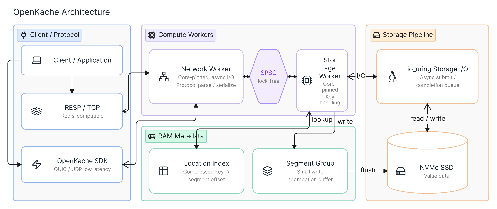

<div align="center">

# OpenKache ⚡

**OpenKache is a high-performance cache server designed from the ground up for modern SSDs.**

Open source · RESP/TCP · OpenKache/QUIC · Linux `io_uring`

[](https://github.com/openkache/openkache/actions)
[](https://www.rust-lang.org/)

**English** · [한국어](./README.ko.md) · [中文](./README.zh.md)

</div>

## Table of contents

- [Benchmarks](#benchmarks)
- [Architecture](#architecture)
- [Quick start](#quick-start)
- [Connect a client](#connect-a-client)
- [Container image](#container-image)
- [Roadmap](#roadmap)
- [Contributing](#contributing)
- [License](#license)
- [Third-party attributions](#third-party-attributions)

---

## Benchmarks

Measured on a 6 vCPU AMD EPYC 7773X host (SSD, kernel 6.8) over loopback, with
32-byte keys and 100-byte values. Each system is driven by a load tool speaking
its own native protocol. Full methodology in [BENCHMARK.md](./BENCHMARK.md).

**GET throughput**

| System | GET throughput | Load tool |
|---|---:|---|
| OpenKache | **97,887 ops/s** | kvbench (RESP) |
| PostgreSQL 17.10 | 17,421 ops/s | kvbench (PostgreSQL wire) |
| MySQL 8.4.11 | 16,295 ops/s | kvbench (MySQL wire) |

OpenKache is 5.6× faster than PostgreSQL and 6.0× faster than MySQL, reaching
76% of the machine's single-core 4 KiB random-read ceiling (128,820 IOPS) with
a single storage core.

**GET latency (one request at a time)**

| System | avg | p50 | p99 | p99.9 |
|---|---:|---:|---:|---:|
| OpenKache | **238.7 µs** | 229 µs | 386 µs | 1376 µs |
| MySQL 8.4.11 | 385.7 µs | 410 µs | 1169 µs | 2207 µs |
| PostgreSQL 17.10 | 558.0 µs | 510 µs | 1263 µs | 3342 µs |

Average GET latency is 1.6× lower than MySQL and 2.3× lower than PostgreSQL; at
p99 it is 3.0× and 3.3× lower.

---

## Architecture

<div align="center">



</div>

**Why is OpenKache fast?** Because it never hops between cores.

Most servers let a thread pool roam across cores. That is not free — lock
contention, mutexes, context switches, and the synchronization and copy cost
paid every time a cache line bounces from one core to another. The heavier the
load, the more this overhead eats into throughput.

OpenKache takes a **thread-per-core (shared-nothing)** design. Each worker is
pinned to a single core, owns its own data, and shares no state — so there are
no locks. This is the same design TigerBeetle, ScyllaDB, and Redis converged on
to squeeze every drop out of the hardware. The network path and the storage
path each own a core, and they communicate through exactly one **lock-free SPSC
queue**. RESP parsing never blocks disk I/O.

Redis runs commands on a single core. OpenKache keeps the same shared-nothing
principle but shards workers across cores, so throughput scales with the
hardware instead of hitting a single-core ceiling — and with no shared locks,
adding a core adds no contention.

Values live on the SSD; keys live in a compact RAM index (compressed key →
segment offset). And just as a subway moves more people than a car, OpenKache
batches writes from many keys into a single sequential **segment-group** flush
instead of one SSD write per key, using the drive's sequential bandwidth to the
fullest — on Linux, submitting that I/O through `io_uring` to erase even the
system-call overhead.

All of it is written in **Rust**: no GC pauses, data races ruled out at compile
time, C-level control in hand. There is no room for a garbage-collection pause
on the fast path.

See [docs/architecture.md](./docs/architecture.md) for the full design.

---

## Quick start

OpenKache is optimized and benchmarked for **Linux**.

- **Windows:** WSL2 is recommended.
- **macOS:** Intended for functional development, not performance comparisons.

Linux requirements:

- Linux with `io_uring`
- two distinct CPUs available to the process

### Docker

Download the image:

```bash
docker pull ghcr.io/openkache/openkache:edge
```

Run the server:

```bash
docker run --rm \
  --network host \
  --security-opt seccomp=unconfined \
  ghcr.io/openkache/openkache:edge
```

### Download and run

OpenKache has not published a stable release yet. Download the source from
[server-v0.1.0](https://github.com/openkache/openkache/releases/tag/server-v0.1.0),
extract it, and run the Cargo command below.

### Cargo

```bash
cargo run --locked --package openkache-server --bin openkache-server
```

---

## Connect a client

With the server running, connect from your language of choice. All client
guides use `127.0.0.1:4433` as the default local endpoint and list the complete
public API for their language.

OpenKache publishes separate client packages for TypeScript/JavaScript, Python,
and Rust. All three share the same protocol and value-format sources:

| Package | Install | Documentation | Source |
|---|---|---|---|
| TypeScript / JavaScript | `npm install openkache` | [npm](https://www.npmjs.com/package/openkache) · [client README](clients/typescript/README.md) | [GitHub](https://github.com/openkache/openkache/tree/main/clients/typescript) |
| Python | `python -m pip install openkache` | [PyPI](https://pypi.org/project/openkache/) · [client README](clients/python/README.md) | [GitHub](https://github.com/openkache/openkache/tree/main/clients/python) |
| Rust | `cargo add openkache` | [crates.io](https://crates.io/crates/openkache) · [docs.rs](https://docs.rs/openkache/latest/openkache/) · [client README](clients/rust/README.md) | [GitHub](https://github.com/openkache/openkache/tree/main/clients/rust) |

See [clients/README.md](./clients/README.md) for the status of additional
bindings, including .NET, Go, C, C++, and Swift.

The Rust SDK in a nutshell:

```rust
use openkache::{Client, Value};

async fn example() -> openkache::Result<()> {
    let client = Client::connect("127.0.0.1:4433").await?;
    client.set("greeting", Value::text("hello")).await?;
    assert_eq!(
        client.get("greeting").await?.unwrap(),
        Value::text("hello"),
    );
    client.close().await?;
    Ok(())
}
```

The source-built [`openkache-cli`](clients/cli/README.md) is the Bash-friendly
option, using the same fixed Gate 0 profile by default:

```bash
openkache-cli set hello "from cli"
openkache-cli get hello
```

Use `openkache-cli --profile configured` when certificate roots, mutual TLS,
client-side value protection, or compatibility-only TTL/conditional writes are
required.

---

## Roadmap

| Milestone | Status | Focus |
|---|---|---|
| SSD storage & dual-protocol server | 🚧 In progress | Segment-group writes, RESP/TCP + QUIC Gate 0 |
| Production hardening | 🔜 Next | Restart recovery, reproducible benchmarks, fuzzing, CI/CD |
| Security & correctness | 📅 Planned | Auth/mTLS, value-protection profiles, full protocol surface |
| Scale & reach | 📅 Planned | Clustering, cross-platform servers, general availability |

Full detail in [ROADMAP.md](./ROADMAP.md).

---

## Contributing

- [Contributing guide](./CONTRIBUTING.md)
- [Community guidelines](./COMMUNITY_GUIDELINES.md)
- [Code of conduct](./CODE_OF_CONDUCT.md)

---

## License

Except where otherwise noted, OpenKache is licensed under the
[GNU Affero General Public License v3.0 or later](./LICENSE). Client SDKs
under [`clients/`](./clients/) and the shared protocol under
[`protocol/`](./protocol/) are licensed under the Apache License 2.0; see
the `LICENSE` file in each directory.

---

## Third-party attributions

Release archives, container images, and client packages include a generated
`THIRD-PARTY-NOTICES.txt` derived from the locked Cargo dependency graph. It
preserves upstream license, notice, and attribution text; OpenKache's own
license remains in the adjacent `LICENSE` file.

Entries without a separate upstream license file are flagged for maintainer
review. Do not redistribute an artifact while its notice contains
`LEGAL REVIEW REQUIRED`. See [`RELEASING.md`](./RELEASING.md) for release
checks and artifact-specific instructions.
