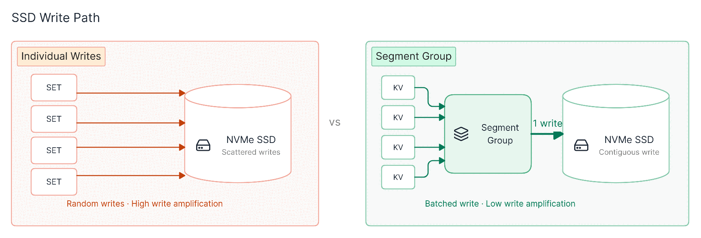

<div align="center">

# OpenKache ⚡

**OpenKache is a high-performance cache server designed from the ground up for modern SSDs.**

Open source · RESP/TCP · OpenKache/QUIC · Linux `io_uring` · Apple Silicon

[](https://github.com/openkache/openkache/actions)
[](https://www.rust-lang.org/)

</div>

## Benchmarks

Measured on a 6 vCPU AMD EPYC 7773X host (SSD, kernel 6.8) over loopback, with
32-byte keys and 100-byte values. Each system is driven by a load tool speaking
its own native protocol. Full methodology in [BENCHMARK.md](./BENCHMARK.md).

**GET throughput**

| System | GET throughput | Load tool |
|---|---:|---|
| OpenKache | **97,887 ops/s** | memtier (RESP) |
| PostgreSQL 17.10 | 17,421 ops/s | pgbench |
| MySQL 8.4.11 | 16,295 ops/s | sysbench |

OpenKache is 5.6× faster than PostgreSQL and 6.0× faster than MySQL, reaching
76% of the machine's single-core 4 KiB random-read ceiling (128,820 IOPS) with
a single storage core.

**GET latency (one request at a time)**

| System | avg | p50 | p99 | p99.9 |
|---|---:|---:|---:|---:|
| OpenKache | **238.7 µs** | 229 µs | 386 µs | 1376 µs |
| MySQL 8.4.11 | 385.7 µs | 410 µs | 1169 µs | 2207 µs |
| PostgreSQL 17.10 | 558.0 µs | 510 µs | 1263 µs | 3342 µs |

Average GET latency is 1.6× lower than MySQL and 2.3× lower than PostgreSQL; at
p99 it is 3.0× and 3.3× lower.

OpenKache reaches this by aggregating many individual writes into sequential
segment-group writes to the SSD, instead of issuing one storage write per key.

## Architecture

<div align="center">




</div>

## Quick start

Requirements:

- Linux with `io_uring`, or Apple Silicon macOS
- Linux with two distinct CPU IDs; Apple Silicon macOS delegates thread
  placement to the scheduler
- Rust plus the native toolchain required by the workspace dependencies when
  building from source

Run on `127.0.0.1:4433`. Linux uses the default CPU arguments 0 and 1; macOS
delegates thread placement to the scheduler:

```bash
cargo run --locked --package openkache-server --bin openkache-server
```

The server uses the same numeric address for RESP/TCP and OpenKache/QUIC. On
Linux, select a different address and CPU pair:

```bash
cargo run --locked --package openkache-server --bin openkache-server -- \
  0.0.0.0:4433 2 3
```

On macOS, select a different address without CPU arguments:

```bash
cargo run --locked --package openkache-server --bin openkache-server -- \
  0.0.0.0:4433
```

The cache file is created in the process working directory and truncated each
time the server starts.

## Download server binaries

The manual `server-v<version>` GitHub Release contains three archives for the
same immutable source tag:

| Platform | Rust target | Archive |
|---|---|---|
| Linux x86_64 | `x86_64-unknown-linux-musl` | `openkache-server-<version>-linux-x86_64-musl.tar.gz` |
| Linux aarch64 | `aarch64-unknown-linux-musl` | `openkache-server-<version>-linux-aarch64-musl.tar.gz` |
| Apple Silicon macOS | `aarch64-apple-darwin` | `openkache-server-<version>-macos-arm64.tar.gz` |

Linux archives are statically linked against musl and still require a Linux
kernel that permits `io_uring`. The macOS archive uses the native polling
fallback and is intended for Apple Silicon hosts. Releases are preview
artifacts: the server recreates its cache file at startup and does not
authenticate clients.

Set `VERSION` to an existing server release and verify the exact archive before
extracting it:

```bash
VERSION=0.1.0
PLATFORM=linux-x86_64-musl
BASE="https://github.com/openkache/openkache/releases/download/server-v${VERSION}"
ARCHIVE="openkache-server-${VERSION}-${PLATFORM}.tar.gz"
curl --fail --location --silent --show-error --remote-name "${BASE}/${ARCHIVE}"
curl --fail --location --silent --show-error --remote-name "${BASE}/SHA256SUMS"
grep -F " ${ARCHIVE}" SHA256SUMS | sha256sum --check
tar -xzf "${ARCHIVE}"
```

On macOS, replace the final checksum command with
`grep -F " ${ARCHIVE}" SHA256SUMS | shasum -a 256 -c -`.

### Use the Rust SDK

```rust
use openkache::{Client, Value};

# async fn example() -> openkache::Result<()> {
let client = Client::connect("127.0.0.1:4433").await?;
client.set("greeting", Value::text("hello")).await?;
assert_eq!(
    client.get("greeting").await?.unwrap(),
    Value::text("hello"),
);
client.close().await?;
# Ok(())
# }
```

The Gate 0 SDK intentionally disables certificate verification for local
development. It still uses TLS 1.3 over QUIC and never falls back to plaintext.

### Install the server

The Linux server binary is published as
[`openkache-server`](https://crates.io/crates/openkache-server):

```bash
cargo install openkache-server
```

See the [`openkache-server` guide](server/README.md) for the command reference,
source installation, and current preview limitations.

### Try a client

The examples in the client READMEs use the local development TLS profile. It
does not verify the server certificate, so use it only with a local development
server; do not reuse this trust profile for production traffic.

| Package | Install | Documentation | Source |
|---|---|---|---|
| TypeScript / JavaScript | `npm install openkache` | [npm](https://www.npmjs.com/package/openkache) · [client README](clients/typescript/README.md) | [GitHub](https://github.com/openkache/openkache/tree/main/clients/typescript) |
| Python | `python -m pip install openkache` | [PyPI](https://pypi.org/project/openkache/) · [client README](clients/python/README.md) | [GitHub](https://github.com/openkache/openkache/tree/main/clients/python) |
| Rust | `cargo add openkache` | [crates.io](https://crates.io/crates/openkache) · [docs.rs](https://docs.rs/openkache/latest/openkache/) · [client README](clients/rust/README.md) | [GitHub](https://github.com/openkache/openkache/tree/main/clients/rust) |

All three client guides use `127.0.0.1:4433` as the default local endpoint.
They also list alternative package managers and the complete public API for
their language.

The source-built [`openkache-cli`](clients/cli/README.md) uses the same fixed
Gate 0 profile by default. It is the Bash-friendly option for the Rust client
and the native QUIC frontend of `my-ideal-prototype`:

```bash
openkache-cli set hello "from cli"
openkache-cli get hello
```

Use `openkache-cli --profile configured` when certificate roots, mutual TLS,
client-side value protection, or compatibility-only TTL/conditional writes
are required.

### Container image

Build locally from the repository root:

```bash
docker build --file server/Dockerfile --tag localhost/openkache:dev .
docker run --rm \
  --security-opt seccomp=unconfined \
  --publish 4433:4433/tcp \
  --publish 4433:4433/udp \
  --volume openkache-data:/var/lib/openkache \
  localhost/openkache:dev
```

Run the published preview image without authenticating to GHCR:

```bash
podman run --rm \
  --security-opt seccomp=unconfined \
  --publish 4433:4433/tcp \
  --publish 4433:4433/udp \
  ghcr.io/openkache/openkache:edge
```

`edge` follows the latest successful build from `main`. For reproducible
deployments, pin the multi-platform manifest by its `sha256` digest instead of
using the rolling tag.

The default container command pins the network thread to CPU 0 and the storage
thread to CPU 1. Override the command when the container CPU set uses different
IDs. See the [container guide](./docs/container-image.md) for details.

## Build and verify

```bash
cargo check --locked
cargo test --locked --package openkache-server
cargo server-build
```

The root Cargo workspace owns the protocol, server, shared client core, Rust
SDK, CLI, and native TypeScript adapter under one lockfile.

Server allocator experiments are available as opt-in features:

```bash
cargo server-build --features alloc-jemalloc
cargo server-build --features alloc-mimalloc
```

Do not enable both allocator features at once.

## Client packages

Maintained client packages share the same protocol and value-format sources.
See [clients/README.md](./clients/README.md) for the current status of Rust,
TypeScript, Python, .NET, Go, C, C++, Swift, and other bindings.

The current server compatibility frontend supports only the Gate 0 operation
subset listed above. Broader APIs described by target contracts may be present
in generated clients before the server implements them.

## Repository layout

| Path | Contents |
| --- | --- |
| `server/` | Current SSD cache server and container definition |
| `protocol/` | Shared wire model, generated contracts, and codecs |
| `clients/` | Client SDKs and native adapters |
| `docs/` | Current usage guides and explicitly identified target documents |

The current server implementation lives in [server/README.md](./server/README.md).
Protocol details live in [protocol/README.md](./protocol/README.md).

## Project status

| Component | Status |
| --- | --- |
| RESP/TCP server | Preview |
| OpenKache/QUIC Gate 0 server | Preview |
| SSD storage and deletion | Preview |
| Restart recovery | Not implemented |
| Production authentication | Not implemented |
| Client SDKs | Preview; see package status |
| Container image | Available for Linux amd64/arm64 |
| Server archives | Linux x86_64/aarch64 static musl and Apple Silicon macOS |
| Clustering | Not started |

## Contributing

- [Contributing guide](./CONTRIBUTING.md)
- [Community guidelines](./COMMUNITY_GUIDELINES.md)
- [Code of conduct](./CODE_OF_CONDUCT.md)

## License

Except where otherwise noted, OpenKache is licensed under the
[GNU Affero General Public License v3.0 or later](./LICENSE). Client SDKs
under [`clients/`](./clients/) and the shared protocol under
[`protocol/`](./protocol/) are licensed under the Apache License 2.0; see
the `LICENSE` file in each directory.
